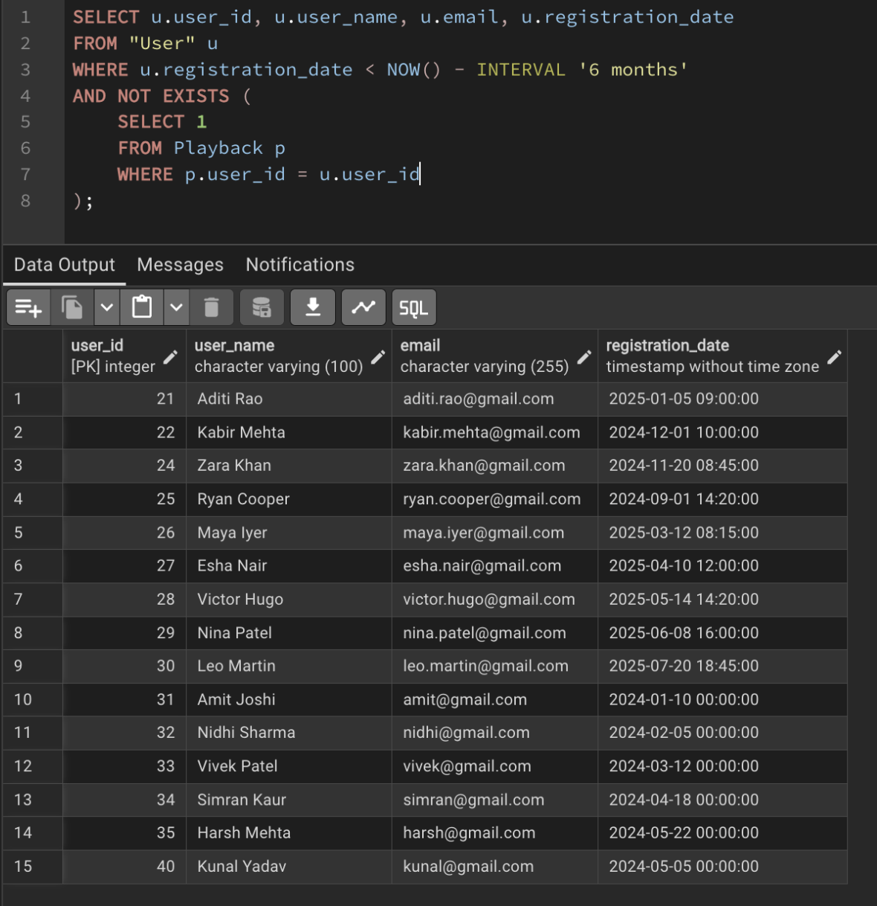
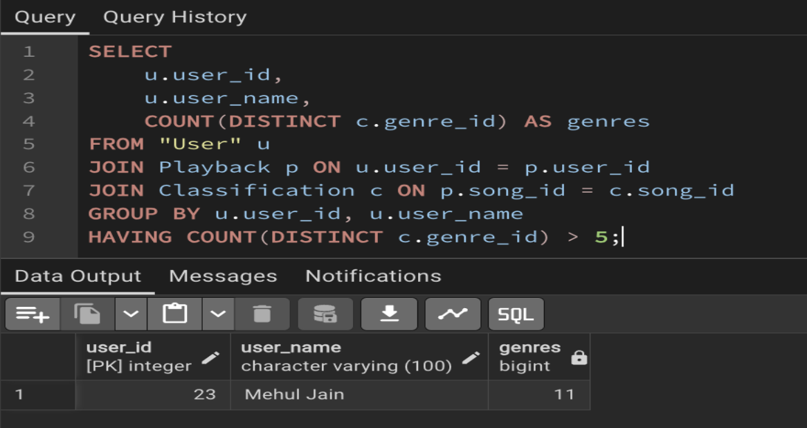

# 📊 Advanced SQL Queries

Advanced SQL queries for **StreamDB** for music streaming analytics and user engagement scenarios.

---

# Scenario 1: User Engagement & Personalization

### 1. Identify users who registered more than 6 months ago but have no playback records.

**Description:**  
Identifies inactive users who registered over six months ago but have never streamed any songs. This query can help target dormant users for re-engagement campaigns.

---

### 2. Find users who listen to more than 5 distinct genres.

**Description:**  
Retrieves users with diverse listening preferences by counting the number of distinct music genres they have streamed. This insight can be used to improve personalized recommendations.

---
