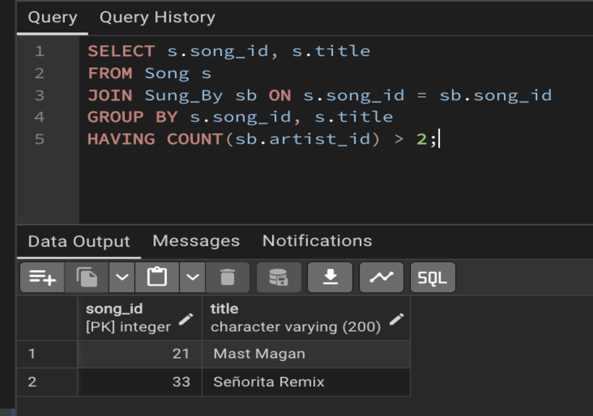
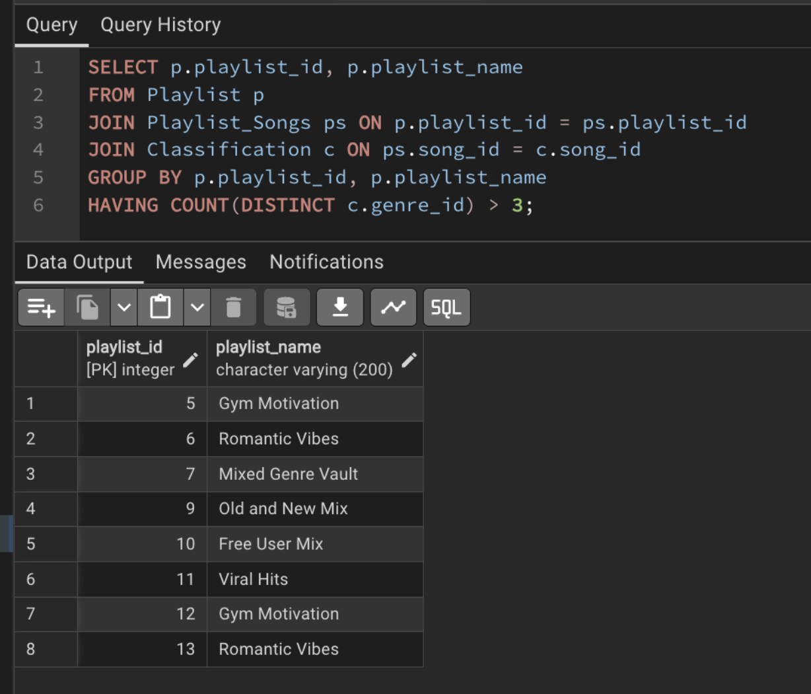
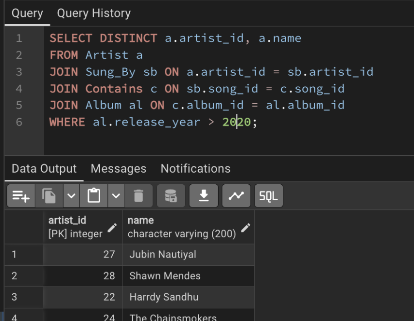
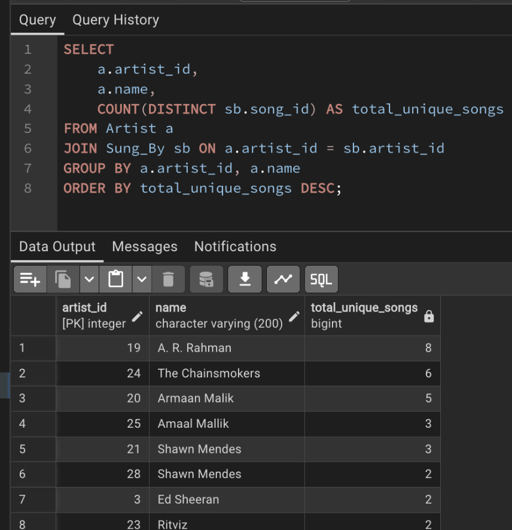
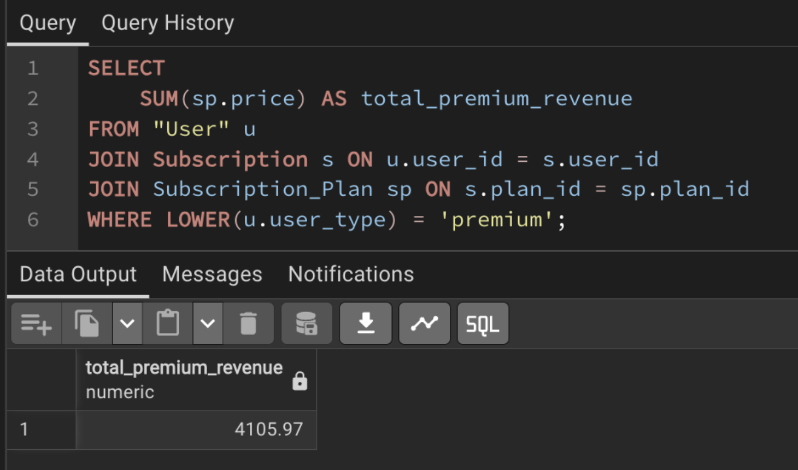
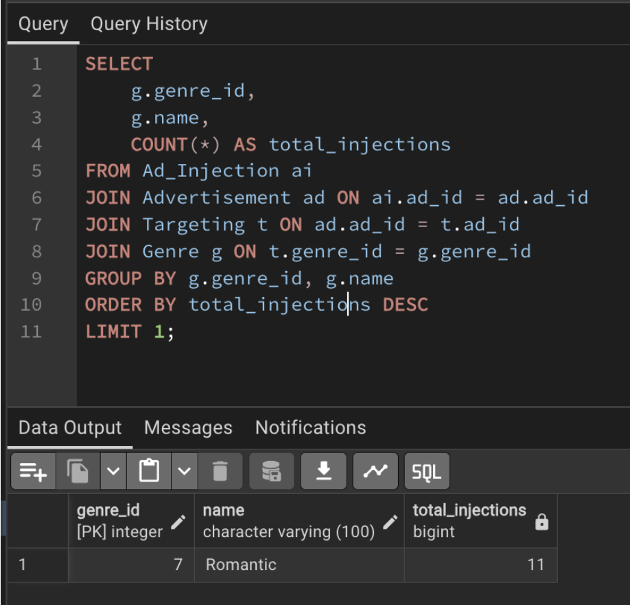

# 📊 Advanced SQL Queries

Advanced SQL queries for **StreamDB** for music streaming analytics and user engagement scenarios.

---

# Scenario 1: User Engagement & Personalization

### 1. Identify users who registered more than 6 months ago but have no playback records.

**Description:**  
Identifies inactive users who registered over six months ago but have never streamed any songs. This query can help target dormant users for re-engagement campaigns.

---

### 2. Find users who listen to more than 5 distinct genres.

**Description:**  
Retrieves users with diverse listening preferences by counting the number of distinct music genres they have streamed. This insight can be used to improve personalized recommendations.

---

# Scenario 2: Song & Library Management

### 1. Find songs performed by more than 2 artists.

**Description:**  
Identifies songs performed by multiple artists, helping analyze collaborations and tracks with shared artist contributions.

---

### 2. Find songs whose average rating is less than or equal to 2.

**Description:**  
Retrieves low-rated songs based on user ratings, enabling administrators to identify underperforming content and improve catalog quality.

---

# Scenario 3: Artist Performance & Insights

### 1. Retrieve artists whose songs are in albums released after 2020.

**Description:**  
Lists artists associated with albums released after 2020, providing insights into recently active artists and their contributions.

---

### 2. Count the total number of unique songs per artist.

**Description:**  
Calculates the number of distinct songs contributed by each artist, helping measure artist productivity and catalog size.

---

# Scenario 4: Ad-Revenue & Business Analytics

### 1. Calculate total potential revenue from active premium users.

**Description:**  
Estimates potential subscription revenue generated by active premium users, supporting business and financial analysis.

---

### 2. Identify the genre that results in the highest number of ad injections.

**Description:**  
Determines which music genre triggers the highest number of advertisement insertions, providing insights for advertising strategy and revenue optimization.

---
